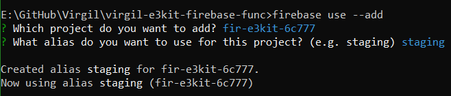
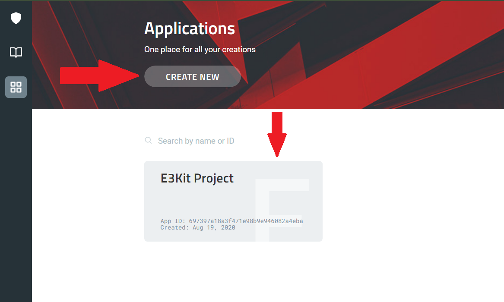
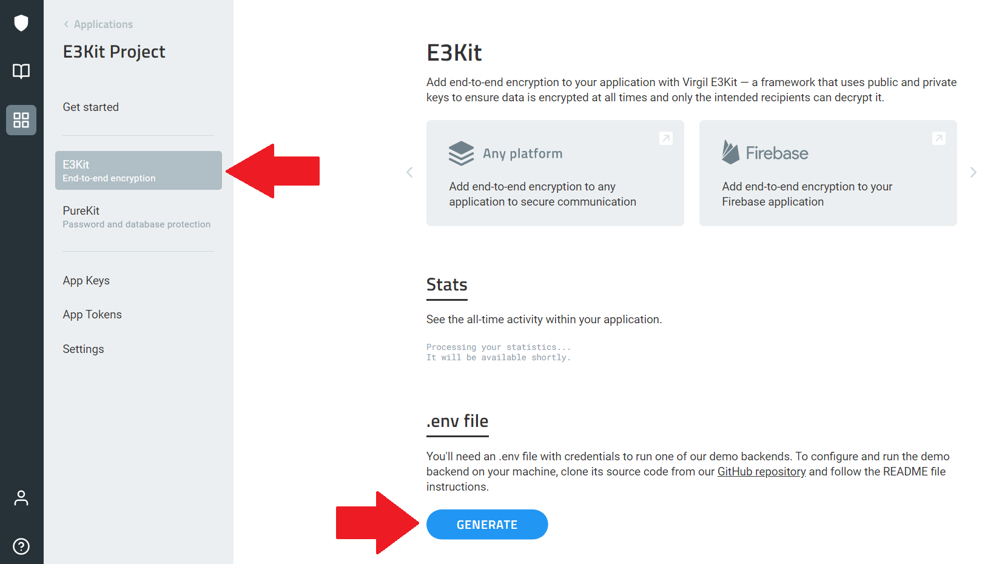
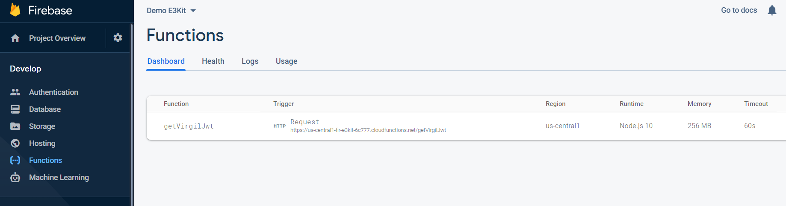

# Configure your Firebase function to generate Virgil JWT

[](https://greenkeeper.io/)

This repository contains a backend's function that connects your Virgil and Firebase accounts for implementing end-to-end encryption.

## Prerequisites
- [Node](https://nodejs.org/en/download) version **from 10 to 13**
> You can use one of node version managers to switch the version: [n](https://github.com/tj/n) or [nvm](https://github.com/creationix/nvm)

## Configure Your Firebase Project

We assume that you already have a Firebase Project. If you don't, please create one now at your [Firebase Console](https://console.firebase.google.com).

### Configure User Authentication

If you haven't already, set up _Sign-in method_ in your Firebase Project by enabling any of the _Sign-in providers_. For the purposes of this tutorial it doesn't matter which sign-in provider you choose.

To set up your Sign-in method, go to your [Firebase Console](https://console.firebase.google.com) and navigate to **Authentication**, under **Develop**. Go to the **Sign-in method** tab and set up your preferred sing-in method(s).

## Deploy the Firebase function

This Firebase function will connect Firebase's and Virgil's authentication via JWT tokens.

- Clone this repository
  ```bash
  git clone https://github.com/VirgilSecurity/virgil-e3kit-firebase-func.git
  cd virgil-e3kit-firebase-func
  ```

### Set up Firebase project

- Install Firebase CLI if you haven't already:
  ```bash
  npm install -g firebase-tools
  ```

- Start up the Firebase CLI:
  ```bash
  firebase login
  ```

- Navigate to this repository and connect it to your Firebase project:
  ```bash
  firebase use --add
  ```

- Select your Firebase project from the list and press ENTER.

- Type an alias for your project and press ENTER again.




### Set up Virgil Application

- [Sign up for a free Virgil account](https://dashboard.virgilsecurity.com/signup)

- Get your Virgil Credentials:

1. Navigate to the Virgil Dashboard -> Your Application -> E3Kit Section.



2. Generate `.env` in the **.env file** section.



3. Download the generated file, paste it into the project root folder and rename it to `.env`.


### Install dependencies

- To install dependencies and configure Virgil Credentials, in cmd navigate to the repository folder and run:
  ```bash
  cd functions
  npm install
  npm run configure
  ```

  > In case you receive a message like `warning found n vulnerabilities` printed in the console after running the `npm install`, there is a potential security vulnerability in one of the demo's dependencies. Don't worry, this is a normal occurrence and in the majority of cases, is fixed by updating the packages. To install any updates, run the command `npm audit fix`. If some of the vulnerabilities persist after the update, check the results of the `npm audit` to see a detailed report. The report includes instructions on how to act on this information.

- If `npm install` fails, make sure you have a compatible node version. See in **Prerequisites**.

* ### **Windows users only**: In **`firebase.json`** rename **`$RESOURCE_DIR`** to **`%RESOURCE_DIR%`**

- Optional: change the field used for identity to `email`, `phone_number` or any unique value in [functions/src/index.ts](https://github.com/VirgilSecurity/virgil-e3kit-firebase-func/blob/master/functions/src/index.ts#L15) . Default is `uid` (Firebase unique id)

### Deploy function

> :warning: Since August 17, 2020, Firebase has [changed their billing plans](https://firebase.google.com/support/faq#expandable-10). In order to deploy the function and run this demo, you will need to change your project billing plan to "Blaze" in project settings "Usage and Billing".

- Deploy the Firebase function:
  ```bash
  npm run deploy
  ```

Now, in your at your [Firebase Console](https://console.firebase.google.com) in "Develop" -> "Functions" you'll be able to see the function deployed:



## Troubleshooting

### Error: Error parsing triggers: Cannot find module '../virgil_crypto_node.node'

Make sure you've followed the instructions in the README. If you did so, try running this command:
```bash
node node_modules/virgil-crypto/scripts/download-node-addon.js
```

### TypeError: Cannot destructure property `app_id` of 'undefined' or 'null'.

You most likely forgot to generate the `.env` file or named it incorrectly. Make sure the file is named exactly `.env` (no '.txt' at the end and no other extensions) and contains your keys in a similar format:
```
APP_ID=40afa3ea[...]520c1be
APP_KEY_ID=0e6f[...]fd3476c3cf
APP_KEY=MC4CAQt[...]7DprlzC7gG1
```

## License

This library is released under the [3-clause BSD License](LICENSE).

## Support
Our developer support team is here to help you. Find out more information on our [Help Center](https://help.virgilsecurity.com/).

You can find us on [Twitter](https://twitter.com/VirgilSecurity) or send us email support@VirgilSecurity.com.

Also, get extra help from our support team on [Slack](https://virgilsecurity.com/join-community).
